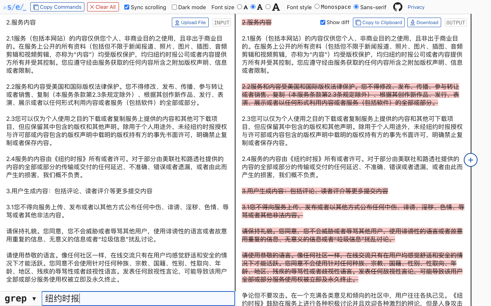

#  Stream Editor | [streameditor.io](https://streameditor.io/)

Stream Editor is an online tool for interactively writing and chaining command-line text manipulation utilities, such as `sed`, `grep`, and `awk`.

Text transformation tools provided by Unix operating systems are incredibly powerful for pattern extraction, formatting, and data manipulation, but a command line isn't always the best interface for using them when it comes to experimentation and debugging, especially if you want to chain several commands together with pipes.

Stream Editor provides an accessible web interface that dynamicalaly updates output as you make changes to input text and the commands applied to it. It allows you to chain multiple commands together and observe the output after each step, optionally with a visual diff of deleted/added text with red/green highlights. Once you've figured out the operations you want to use, you can export them as a series of command-line pipes with a single click, or share them with a unique URL.

[Read more on my website](https://harrisonliddiard.com/project/stream-editor/).

## Screenshots

### Stream Editor default view

### Stream Editor light theme, showcasing its full Unicode support

### Stream Editor being used to analyze its own logs, examining the effect of chaining multiple commands together at each step

## Requirements

- MacOS or Linux (sorry, these commands are not all available on Windows)
- Python 3.7+

## Installation (Development)

1. clone the repo
2. (optional but recommended) [set up a virtual environment](https://docs.python.org/3/tutorial/venv.html) for the project, and activate it
3. `pip3 install -r requirements.txt`
4. `FLASK_ENV=development python3 dev_server.py`
5. `cd client`
6. `npm install && npm start`
